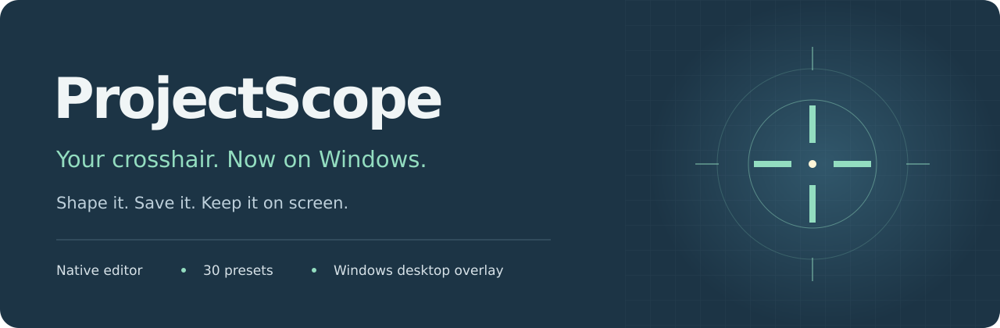

# ProjectScope-Windows

Private development of the Windows edition of ProjectScope. Create a crosshair, tune it live, and keep it on screen with the editor tucked into the system tray.

**Status: Windows preview in development.** The [public Linux edition](https://github.com/DMoneyManZ/ProjectScope) remains a separate GNOME application. This repository and its Windows build artifacts are private.

## What is included

- The same 30 stock presets and validated JSON import/export format as ProjectScope for Linux.
- A Qt editor with live preview, lines/dot/ring geometry, color, outline, opacity, scale, and rotation controls.
- A transparent, click-through overlay with monitor selection and position offsets.
- Windows global hotkeys, conflict reporting, and a system-tray menu to reopen, toggle, or quit.
- A packaged application with Python and Qt included, using the crosshair icon for the app and executable.

The first Windows backend uses ordinary opacity blending. GNOME's destination-color inversion is not available in this version. Desktop and borderless-window use is the initial target; protected-game and exclusive-fullscreen compatibility are not established.

## Install or build

See the [Windows installation guide](docs/WINDOWS-INSTALL.md) for private downloads, bundled dependencies, source builds, and uninstall instructions. Preview downloads will be listed in this repository's [Releases](https://github.com/DMoneyManZ/ProjectScope-Windows/releases).

From source on Windows with Python 3.12:

~~~powershell
py -3.12 -m venv .venv
.\.venv\Scripts\python.exe -m pip install -r windows\requirements.txt
.\.venv\Scripts\python.exe -m projectscope.windows
~~~

Normal use stores preferences and personal presets under %LOCALAPPDATA%/ProjectScope. It does not capture the desktop, inspect games, send telemetry, or collect model-training data.

## Default controls

| Keys | Action |
|---|---|
| Home | Show or hide |
| Page Up / Page Down | Previous / next preset |
| Pause | Randomize |
| Insert | Save current design |
| End | Cycle color |
| Shift + Page Up / Page Down | Increase / decrease size |
| Ctrl + Page Up / Page Down | Increase / decrease thickness |

Shortcuts are global while ProjectScope is running. Conflicts with another application are reported rather than silently treated as working. Quit from the tray menu to release them.

## Verification

Windows CI tests portable presets, preferences, Qt rendering and controls, and native hotkey registration. The packaged executable runs a separate smoke check that records its native overlay window styles and captures its own editor window. This test-only capture is invoked with --smoke-test; normal operation does not capture screens.

On Linux, portable UI tests use Qt's offscreen platform and do not prove Windows-native behavior. Real hardware checks are still needed for game behavior, taskbar/tray appearance, display scaling and monitor hotplug.

## License

Copyright © 2026 DMoneyManZ. [GPL-3.0-only](LICENSE). Dependency notices and corresponding source information ship with the Windows package. Private repository visibility does not change the license of the underlying ProjectScope code.
